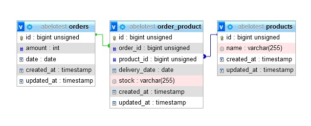

# 0019

Магазин складає групові замовлення (Orders::class) на овочі (Products::class) з різних складів (pivot.stock) кожна доставка продукту має свою дату доставки (pivot.delivery_date). 

<p align="center"></p>

# Встановлення:

- клонувати
- створити базу
- вписати в .env параметри бази і адресу сайта
- залити дамп abelotest.sql
- запустити "composer install"
- колекція для Postman abelo.postman_collection.json

# Параметри для запиту:

- 'order_id' => 'integer', // номер замовлення
- 'date_from' => 'date_format:Y-m-d', // дата замовлення
- 'date_to' => 'date_format:Y-m-d', // дата замовлення
- 'amount_from' => 'integer', // сумма замовлення
- 'amount_to' => 'integer', // сумма замовлення
- 'product' => 'string', // назва продукта (частина слова)
- 'stock' => 'string', // назва склада (частина слова)
- 'delivery_date_from' => 'date_format:Y-m-d', // дата доставки даного продукту з даного складу
- 'delivery_date_to' => 'date_format:Y-m-d', // дата доставки даного продукту з даного складу
- 'sort'    => 'array', // сортування
- 'sort.*' => 'in:order_id,date,amount,stock,delivery_date,product',
- 'direction'  => 'array', // подялок сортування
- 'direction.*' => 'in:asc,desc',
- Ключ авторизації в heder: "key":"x-api-key" = "abcd"

Наприклад:
```
SITE/api/list?
date_to=2022-04-30&
date_from=2022-04-30&
product=ка&
stock=че&
amount_from=4&
amount_to=20910&
sort[]=stock&
direction[stock]=desc
```
# URLs API:

### SITE/api/product?... - вибір продуктів із замовленнями
```json
{
	"success": true,
	"message": "OK",
	"data": [
		{
			"id": 3,
			"name": "\u041a\u0430\u0440\u0442\u043e\u043f\u043b\u044f",
			"orders": [
				{
					"id": 32,
					"amount": 18671,
					"date": "2022-04-30",
					"stock": "\u0427\u0435\u0440\u043d\u0456\u0433\u0456\u0432",
					"delivery_date": "2022-05-03",
					"pivot": {
						"product_id": 3,
						"order_id": 32
					}
				},
				{
					"id": 32,
					"amount": 18671,
					"date": "2022-04-30",
					"stock": "\u0427\u0435\u0440\u043d\u0456\u0432\u0446\u0456",
					"delivery_date": "2022-05-11",
					"pivot": {
						"product_id": 3,
						"order_id": 32
					}
				},
				{
					"id": 48,
					"amount": 13597,
					"date": "2022-04-30",
					"stock": "\u0427\u0435\u0440\u043d\u0456\u0432\u0446\u0456",
					"delivery_date": "2022-06-20",
					"pivot": {
						"product_id": 3,
						"order_id": 48
					}
				}
			]
		},
		{
			"id": 2,
			"name": "\u041a\u0430\u043f\u0443\u0441\u0442\u0430",
			"orders": [
				{
					"id": 48,
					"amount": 13597,
					"date": "2022-04-30",
					"stock": "\u0427\u0435\u0440\u043d\u0456\u0432\u0446\u0456",
					"delivery_date": "2022-05-24",
					"pivot": {
						"product_id": 2,
						"order_id": 48
					}
				},
				{
					"id": 62,
					"amount": 20910,
					"date": "2022-04-30",
					"stock": "\u0427\u0435\u0440\u043d\u0456\u0432\u0446\u0456",
					"delivery_date": "2022-06-05",
					"pivot": {
						"product_id": 2,
						"order_id": 62
					}
				}
			]
		}
	]
}
```

### SITE/api/order?... - вибір замовлень із продуктами

```json
{
	"success": true,
	"message": "OK",
	"data": [
		{
			"id": 32,
			"amount": 18671,
			"date": "2022-04-30",
			"products": [
				{
					"id": 3,
					"name": "\u041a\u0430\u0440\u0442\u043e\u043f\u043b\u044f",
					"stock": "\u0427\u0435\u0440\u043d\u0456\u0433\u0456\u0432",
					"delivery_date": "2022-05-03",
					"pivot": {
						"order_id": 32,
						"product_id": 3
					}
				},
				{
					"id": 3,
					"name": "\u041a\u0430\u0440\u0442\u043e\u043f\u043b\u044f",
					"stock": "\u0427\u0435\u0440\u043d\u0456\u0432\u0446\u0456",
					"delivery_date": "2022-05-11",
					"pivot": {
						"order_id": 32,
						"product_id": 3
					}
				}
			]
		},
		{
			"id": 48,
			"amount": 13597,
			"date": "2022-04-30",
			"products": [
				{
					"id": 2,
					"name": "\u041a\u0430\u043f\u0443\u0441\u0442\u0430",
					"stock": "\u0427\u0435\u0440\u043d\u0456\u0432\u0446\u0456",
					"delivery_date": "2022-05-24",
					"pivot": {
						"order_id": 48,
						"product_id": 2
					}
				},
				{
					"id": 3,
					"name": "\u041a\u0430\u0440\u0442\u043e\u043f\u043b\u044f",
					"stock": "\u0427\u0435\u0440\u043d\u0456\u0432\u0446\u0456",
					"delivery_date": "2022-06-20",
					"pivot": {
						"order_id": 48,
						"product_id": 3
					}
				}
			]
		},
		{
			"id": 62,
			"amount": 20910,
			"date": "2022-04-30",
			"products": [
				{
					"id": 2,
					"name": "\u041a\u0430\u043f\u0443\u0441\u0442\u0430",
					"stock": "\u0427\u0435\u0440\u043d\u0456\u0432\u0446\u0456",
					"delivery_date": "2022-06-05",
					"pivot": {
						"order_id": 62,
						"product_id": 2
					}
				}
			]
		}
	]
}
```
### SITE/api/list?... - вибір замовлень і продуктів одночасно

```json
{
	"success": true,
	"message": "OK",
	"data": [
		{
			"id": 32,
			"amount": 18671,
			"date": "2022-04-30",
			"stock": "\u0427\u0435\u0440\u043d\u0456\u0433\u0456\u0432",
			"delivery_date": "2022-05-03",
			"name": "\u041a\u0430\u0440\u0442\u043e\u043f\u043b\u044f"
		},
		{
			"id": 32,
			"amount": 18671,
			"date": "2022-04-30",
			"stock": "\u0427\u0435\u0440\u043d\u0456\u0432\u0446\u0456",
			"delivery_date": "2022-05-11",
			"name": "\u041a\u0430\u0440\u0442\u043e\u043f\u043b\u044f"
		},
		{
			"id": 48,
			"amount": 13597,
			"date": "2022-04-30",
			"stock": "\u0427\u0435\u0440\u043d\u0456\u0432\u0446\u0456",
			"delivery_date": "2022-05-24",
			"name": "\u041a\u0430\u043f\u0443\u0441\u0442\u0430"
		},
		{
			"id": 48,
			"amount": 13597,
			"date": "2022-04-30",
			"stock": "\u0427\u0435\u0440\u043d\u0456\u0432\u0446\u0456",
			"delivery_date": "2022-06-20",
			"name": "\u041a\u0430\u0440\u0442\u043e\u043f\u043b\u044f"
		},
		{
			"id": 62,
			"amount": 20910,
			"date": "2022-04-30",
			"stock": "\u0427\u0435\u0440\u043d\u0456\u0432\u0446\u0456",
			"delivery_date": "2022-06-05",
			"name": "\u041a\u0430\u043f\u0443\u0441\u0442\u0430"
		}
	]
}
```
